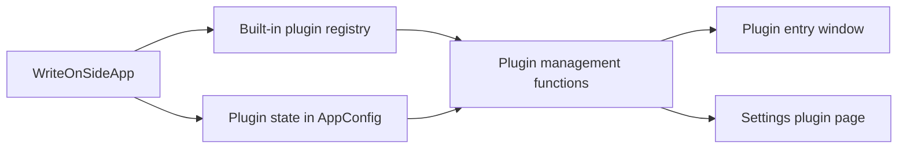

# WriteOnSide Plugin Guide

This guide describes the first version of the WriteOnSide plugin system. The current design focuses on built-in plugins that ship with the application, while keeping the interface ready for future external plugin packages.

## Goals

- Keep the core editor stable and small.
- Move optional features into plugins.
- Let users enable, disable, remove, and restore built-in plugins from Settings.
- Give future plugin developers a clear boundary between plugin code and the main application.
- Avoid executing arbitrary external code until a stronger sandbox and permission model exists.

## Current Architecture

WriteOnSide uses three layers for plugins:

- Plugin manifest registry: `writeonside_app/plugins.py`
- Plugin state in user config: `AppConfig.enabled_plugins`, `disabled_plugins`, `removed_plugins`
- Plugin UI surfaces: `writeonside_app/ui/plugins.py` and the Plugins page in Settings



## Plugin Manifest

Each plugin is represented by a `PluginManifest`:

```python
PluginManifest(
    id="calendar",
    name_key="plugins.placeholder.calendar",
    description_key="plugins.description.calendar",
    icon="📅",
    version="0.1.0",
    entrypoint="",
)
```

Field meaning:

- `id`: Stable unique identifier. Use lowercase snake case, for example `ai_helper` or `export_pack`.
- `name_key`: i18n key for the plugin display name.
- `description_key`: i18n key for the plugin description in Settings.
- `icon`: Short visual marker shown in the plugin entry UI.
- `version`: Plugin interface version or feature version.
- `entrypoint`: Reserved for the future action hook. Empty means the plugin is only a placeholder.

## Plugin State

Plugin state is stored in the user config:

- `enabled_plugins`: Explicitly enabled plugin ids.
- `disabled_plugins`: Plugin ids hidden from the plugin entry but still installed.
- `removed_plugins`: Built-in plugin ids treated as removed by the user.

For built-in plugins, removal is logical rather than physical. The code is still packaged inside the EXE, but the plugin is hidden from the entry page until restored in Settings.

State priority:

1. `removed`
2. `disabled`
3. `enabled`

## Public Management Functions

Use the helpers in `writeonside_app/plugins.py` instead of editing config lists directly:

- `available_plugins(config)`: Returns built-in plugins that are not removed.
- `enabled_plugins(config)`: Returns available plugins that are not disabled.
- `removed_plugins(config)`: Returns removed built-in plugins.
- `plugin_status(config, plugin_id)`: Returns `enabled`, `disabled`, `removed`, or `unknown`.
- `enable_plugin(config, plugin_id)`: Enables or restores a plugin.
- `disable_plugin(config, plugin_id)`: Disables a plugin without removing it.
- `remove_plugin(config, plugin_id)`: Hides a built-in plugin from the plugin entry.
- `restore_plugin(config, plugin_id)`: Restores a removed built-in plugin.

## UI Rules

The plugin entry window should be a launcher, not a settings surface.

- Show only enabled plugins.
- Keep cards short: icon, name, and a simple status or hint.
- Do not expose delete/restore actions in the launcher.
- Use the Settings plugin page for management.
- Follow current theme colors through `ThemeMixin` and `_refresh_plugin_window_theme()`.

The Settings plugin page should be the source of plugin management:

- Show every built-in plugin.
- Show current state.
- Provide enable, disable, remove, and restore actions.
- Save state through normal settings save flow.
- Discard state if the user discards Settings changes.

## Plugin Development Boundary

Plugins should not directly mutate unrelated main application state. A plugin should call a small app-facing API instead.

Recommended future API surface:

```python
class PluginContext:
    app: WriteOnSideApp
    config: AppConfig

    def current_note_path(self) -> Path | None: ...
    def get_editor_text(self) -> str: ...
    def replace_editor_text(self, content: str) -> None: ...
    def insert_text(self, content: str) -> None: ...
    def open_note(self, path: Path) -> None: ...
    def create_note(self, title: str, body: str = "") -> Path: ...
    def show_status(self, message: str) -> None: ...
    def show_error(self, message: str) -> None: ...
```

First-party plugin code can still live inside WriteOnSide, but it should act as if only `PluginContext` is available. That keeps future external plugin support realistic.

## Suggested Plugin File Pattern

For a real built-in plugin, prefer a small module per plugin:

```text
writeonside_app/
  plugins.py
  builtin_plugins/
    calendar.py
    export_pack.py
    templates.py
```

Each plugin module can expose a simple action function:

```python
def run(context: PluginContext) -> None:
    context.show_status("Calendar plugin is not implemented yet.")
```

Then the manifest can later point to the callable:

```python
PluginManifest(
    id="calendar",
    name_key="plugins.placeholder.calendar",
    description_key="plugins.description.calendar",
    icon="📅",
    version="0.1.0",
    entrypoint="writeonside_app.builtin_plugins.calendar:run",
)
```

## First Built-in Plugin

The first active plugin is `pedigree_analysis`.

Runtime files:

```text
writeonside_app/
  builtin_plugins/
    pedigree_analysis.py
rust_extensions/
  pedigree_analysis/
    Cargo.toml
    pyproject.toml
    src/lib.rs
```

The Python module owns the UI, table reading, column mapping, Markdown report generation, and linked CSV output. The Rust extension exposes `writeonside_pedigree.analyze_pedigree()` for pedigree QC and inbreeding calculations.

Build notes:

- `build_release.ps1` builds and installs the Rust extension into the project venv before PyInstaller runs.
- The PyInstaller spec lists `writeonside_pedigree` as a hidden import so the compiled extension is bundled.
- Generated reports are saved below `Plugins/PedigreeAnalysis/` inside the current WriteOnSide workspace.

## Adding a Built-in Plugin

1. Add a `PluginManifest` to `BUILTIN_PLUGINS` in `writeonside_app/plugins.py`.
2. Add `plugins.placeholder.<id>` and `plugins.description.<id>` to locale files.
3. Implement the action module if the plugin should do something.
4. Make the plugin entry window call the entrypoint.
5. Add tests for registration, state handling, and UI visibility.

## Future External Plugin Support

When WriteOnSide is ready for external plugins, use a folder such as:

```text
%LOCALAPPDATA%/WriteOnSide/plugins/
  my_plugin/
    plugin.json
    main.py
```

Possible `plugin.json`:

```json
{
  "id": "my_plugin",
  "name": "My Plugin",
  "description": "Adds a custom workflow.",
  "version": "0.1.0",
  "entrypoint": "main:run",
  "permissions": ["read_current_note", "write_current_note"]
}
```

Do not enable this model until there is a permission and trust policy. External plugins can execute code, so they need stricter validation than built-in plugins.

## Testing Checklist

For any plugin-related change:

- `python -m unittest tests.test_plugins`
- `python -m unittest tests.test_config`
- `python -m unittest tests.test_i18n`
- `python -m unittest discover tests`

Test cases should cover:

- Plugin ids are normalized.
- Removed plugins are hidden from the entry page.
- Disabled plugins are hidden but restorable.
- Settings discard restores previous plugin state.
- Missing or unknown plugin ids do not crash startup.

## Design Principles

- Keep plugin state in config, not in note front matter.
- Keep optional features out of core editor code when possible.
- Prefer explicit app APIs over direct widget mutation.
- Keep plugin UI theme-aware.
- Make built-in plugins removable from the user perspective, even though code remains packaged.
